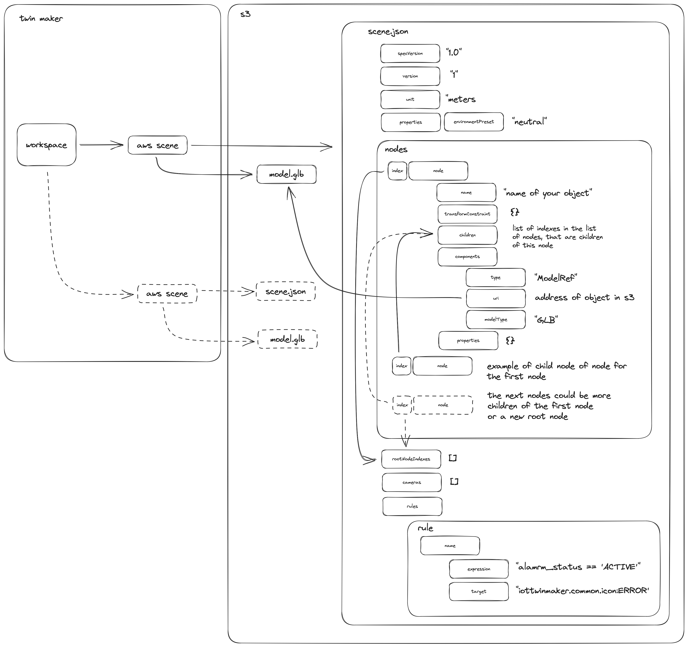

# TwinMakerSceneTools
Exploration of AWS Twin Maker Scenes; functions associated with scene manipulation - Examples might be adding nodes, children of nodes, motion indicators.

You will need to organize and upload your reference GLB's and keep their URI's for usage with adding new nodes to the scene. 
You can reference the same asset multiple times on the scene. 



import json

# Import the necessary classes and functions

# Class definitions

## Component
### Parameters
- `type` (str, default: 'ModelRef'): The type of the component.
- `uri` (str, default: 's3://twinmaker-workspace-<your workspace name>-XXXXXXXXX-iad/defaultObject.glb'): The URI of the component.
- `modelType` (str, default: 'GLB'): The model type of the component.

### Methods
- `to_json()`: Converts the component object to a JSON representation.

## Transform
### Parameters
- `position` (list[float], default: [0, 0, 0]): The position of the transform.
- `rotation` (list[float], default: [0, 0, 0]): The rotation of the transform.
- `scale` (list[int], default: [1, 1, 1]): The scale of the transform.

### Methods
- `to_json()`: Converts the transform object to a JSON representation.

## Statement
### Parameters
- `expression` (str, default: "alarm_status == 'ACTIVE'"): The expression of the statement.
- `target` (str, default: 'ERROR'): The target of the statement.

### Methods
- `to_json()`: Converts the statement object to a JSON representation.

## Camera
### Parameters
- `name` (str, default: 'testCamera'): The name of the camera.
- `transform` (Transform, default: Transform().to_json()): The transform of the camera.
- `cameraIndex` (int, default: 0): The camera index of the camera.

### Methods
- `to_json()`: Converts the camera object to a JSON representation.

## Tag
### Parameters
- `name` (str, default: 'testTag'): The name of the tag.
- `transform` (Transform, default: Transform().to_json()): The transform of the tag.
- `content` (str, default: 'testContent'): The content of the tag.

### Methods
- `to_json()`: Converts the tag object to a JSON representation.

## Rule
### Parameters
- `name` (str, default: 'testRule'): The name of the rule.
- `statements` (list[Statement], default: [Statement().to_json()]): The statements of the rule.

### Methods
- `to_json()`: Converts the rule object to a JSON representation.

## Node
### Parameters
- `name` (str, default: 'testNode'): The name of the node.
- `transform` (Transform, default: Transform().to_json()): The transform of the node.
- `children` (list, default: []): The children of the node.
- `childIndexes` (list[int], default: []): The child indexes of the node.
- `components` (list, default: []): The components of the node.
- `properties` (json, default: {}): The properties of the node.

### Methods
- `addChild(child)`: Adds a child to the node.
- `childCount()`: Returns the number of children in the node.
- `addComponent(**kwargs)`: Adds a component to the node.
- `to_json()`: Converts the node object to a JSON representation.

## MotionIndicator (inherits from Node)
### Parameters
- Inherits all parameters from the Node class.
- `type` (str, default: 'MotionIndicator'): The type of the motion indicator.
- `shape` (str, default: 'LinearPlane'): The shape of the motion indicator.
- `numOfRepeatInY` (optional): The number of repeats in the Y direction.
- `defaultSpeed` (optional): The default speed of the motion indicator.
- `defaultForegroundColor` (optional): The default foreground color of the motion indicator.

### Methods
- `to_json()`: Converts the motion indicator object to a JSON representation.

## Scene
### Parameters
- `specVersion` (str, default: '1.0'): The specification version of the scene.
- `version` (str, default: '1'): The version of the scene.
- `unit` (str, default: 'meters'): The unit of measurement used in the scene.
- `properties` (json, default: {...}): The properties of the scene.
- `nodes` (list, default: []): The nodes in the scene.
- `rootNodeIndexes` (list[int], default: []): The indexes of the root nodes in the scene.
- `cameras` (list[json], default: []): The cameras in the scene.
- `rules` (json, default: {...}): The rules in the scene.

### Methods
- `addNode(**kwargs)`: Adds a node to the scene.
- `addMotionIndicator(**kwargs)`: Adds a motion indicator to the scene.
- `getNodeIndex(node)`: Returns the index of a node in the scene.
- `addRootNodeIndex(index)`: Adds a root node index to the scene.
- `addCamera(**kwargs)`: Adds a camera to the scene.
- `addTag(**kwargs)`: Adds a tag to the scene.
- `addRule(**kwargs)`: Adds a rule to the scene.
- `to_json()`: Converts the scene object to a JSON representation.
- `testScene()`: Creates a test scene with predefined elements.

## Example Usage
```python
# Create a scene object
scene = Scene()

# Add nodes, components, cameras, tags, rules, etc. to the scene

# Generate the JSON representation of the scene
scene_json = scene.to_json()

# Print the JSON representation
print(json.dumps(scene_json, indent=2))
